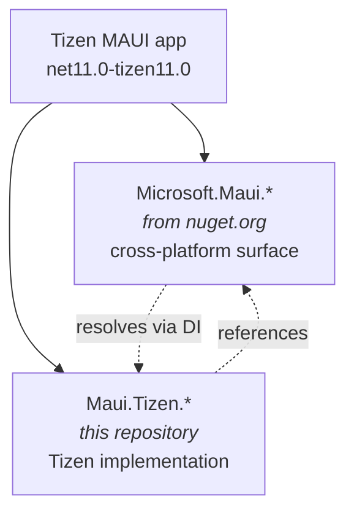

# Architecture

How the Tizen backend composes with .NET MAUI once it lives outside `dotnet/maui`, and
the rules that keep the two from colliding.

## The core problem

Inside `dotnet/maui`, the Tizen backend was not a separate component. It was a set of
files compiled *into* `Microsoft.Maui.Core.dll`, `Microsoft.Maui.Controls.Core.dll` and
friends, selected by the `net9.0-tizen7.0` target framework. Tizen code could freely be
the other half of a `partial` type, or touch `internal` members, because it was in the
same assembly.

Extracting it breaks exactly that. A Tizen app now loads **two** sets of assemblies:



Everything below follows from that one change: **code that used to share an assembly no
longer does.**

## Three identities, answered differently

The word "name" hides three separate decisions. Conflating them is the main way this
kind of extraction goes wrong, so they are settled independently.

| Identity | Policy | Why |
|---|---|---|
| **Package ID** | `Maui.Tizen.*` | This repository is externally owned. Publishing `Microsoft.Maui.Core` from here would squat a Microsoft-owned ID. |
| **Assembly name** | `Maui.Tizen.*` | Two assemblies with the same simple name cannot both load. `Maui.Tizen.Core.dll` and `Microsoft.Maui.Core.dll` coexist; two `Microsoft.Maui.Core.dll`s do not. |
| **Namespace** | `Microsoft.Maui.*` preserved | Namespaces are compile-time only and do not participate in assembly identity. Keeping them means thousands of imported lines compile unchanged and consumers rewrite no `using` directives. |

So a type stays `Microsoft.Maui.Platform.MauiPageView` while living in
`Maui.Tizen.Core.dll` shipped as package `Maui.Tizen.Core`. That is intentional, not an
inconsistency.

## Type collision rules

A collision occurs when two *loaded* assemblies declare the same fully-qualified type
name. Whether that is possible depends on what the neutral assembly contains for
`net11.0-tizen11.0`.

### Rule 1 — Preserve names that were Tizen-only upstream

If a type only ever existed in the Tizen compilation (`Tizen/**`, `*.Tizen.cs`), the
neutral MAUI assembly does not contain it, so there is nothing to collide with. **Keep
the original namespace and type name.**

```csharp
// Imported unchanged.
namespace Microsoft.Maui.Platform
{
    public class MauiPageView : ViewGroup { }
}
```

This covers the large majority of the extraction and is why the import kept
`Microsoft.Maui.*` namespaces.

### Rule 2 — New implementation types go under `Microsoft.Maui.Platforms.Tizen.*`

Anything *new* — written here rather than inherited — uses the reserved prefix:

```csharp
namespace Microsoft.Maui.Platforms.Tizen
{
    internal sealed class TizenWindowManager { }
}
```

`Microsoft.Maui.Platforms.*` is unused throughout `dotnet/maui` (verified against the
source baseline), so it cannot collide with anything upstream now or later. It also
makes the origin of a type obvious in a stack trace, which matters when two assemblies
contribute to one logical feature.

### Rule 3 — Partial types cannot span assemblies, so they must be rebuilt

This is the constraint that shapes the whole migration. Upstream:

```csharp
// Microsoft.Maui.Core, shared file
public partial class ButtonHandler
{
    public static partial void MapText(IButtonHandler handler, IText button);
}

// Microsoft.Maui.Core, Tizen file — SAME assembly
public partial class ButtonHandler
{
    public static partial void MapText(...) { /* Tizen */ }
}
```

Here, the second half would be in a *different* assembly, which C# does not permit. Such
files therefore carry the **`rebuild`** disposition: the behaviour is reimplemented
against MAUI's public extensibility points instead of being copied.

This is why the [PR #36657](https://github.com/dotnet/maui/pull/36657) Essentials work is
a hard prerequisite (`requiredAncestor` in `eng/baselines.json`): it bridges the static
Essentials facades to DI-resolved implementations, which is what lets an out-of-tree
assembly supply them at all.

### Rule 4 — Shared files with `#if TIZEN` are never copied wholesale

135 shared files in the source baseline contain genuine `#if TIZEN` branches (a 136th,
`Matrix3x2Extensions.cs`, uses the legacy Xamarin.Forms-era `TIZEN40` symbol and is not
one of ours). Copying such a file
would fork the non-Tizen code alongside it — code this repository does not own and cannot
maintain. Only the Tizen branch is extracted; the rest stays upstream. The disposition
schema enforces this: `kind: shared-conditional` may only be `rebuild`, `keep-upstream`,
or `exclude`, never `move`.

### Collision risk summary

| `collisionRisk` | Meaning | Action |
|---|---|---|
| `none` | Type existed only in the Tizen compilation | Preserve name (Rule 1) |
| `namespace-only` | Namespace shared, type name unique | Preserve name |
| `type-name` | Same full type name exists in the neutral assembly | Rename under `Microsoft.Maui.Platforms.Tizen.*` (Rule 2) |
| `assembly-identity` | Requires being *inside* a MAUI assembly (partial/internal) | Rebuild (Rule 3) or keep upstream |

## Target framework and version floor

```
net11.0-tizen11.0
```

| Property | Value | Notes |
|---|---|---|
| .NET floor | **11.0** | No .NET 10. Below 11 the Essentials extensibility work does not exist, so the architecture above is not achievable. |
| Tizen platform | **11.0** | TizenFX API15 / `Samsung.Tizen.Ref.API15` 15.0.0.19396. |
| SDK band | **11.0.100-preview.7** | |
| `tizen-manifest.xml` | api-version **11** | |

`dotnet/maui` still pins `tizen7.0`, a version the current Samsung SDK no longer lists as
supported. That value is deliberately **not** carried forward.

There is no neutral `net11.0` fallback, by design. A neutral build would compile cleanly
and produce assemblies that cannot run on Tizen — a green build hiding a broken product.
The missing workload is instead surfaced as an explicit error (`MAUITIZEN0001`).

## Package layout

| Package | Contents | Status |
|---|---|---|
| `Maui.Tizen.Core` | Handlers, platform views, lifecycle, fonts, image sources | Skeleton |
| `Maui.Tizen.Controls` | Shell, CollectionView, shapes, gesture/modal managers, `TizenSpecific` | Skeleton |
| `Maui.Tizen.Essentials` | Sensors, device info, connectivity, storage, media | Skeleton |
| `Maui.Tizen.BlazorWebView` | BlazorWebView platform implementation | Skeleton |
| `Maui.Tizen.Maps` | Map handlers and controls | Skeleton |
| `Maui.Tizen.Graphics` | Skia view | **Provisional** — likely `keep-upstream` |
| `Maui.Tizen.Compatibility` | — | **Provisional** — likely deleted |
| `Maui.Tizen.Build.Tasks` | Manifest/resource/splash MSBuild tasks | Ships — built, packed and tested by the workload-free lane |
| `Maui.Tizen.Templates` | `dotnet new` templates | Ships — `maui-tizen`, packed and instantiated by tests |

"Skeleton" means the project declares its identity, dependencies and packing metadata but
compiles no sources yet — see `eng/targets/TizenPackage.props` for why that is deliberate
rather than unfinished.

## Build host matrix

Everything above is about the *device*. This is about the *machine running the build*:
`Maui.Tizen.Build.Tasks` rasterizes icons and composes splash screens in-process with SkiaSharp, so
it needs a native Skia binary for the host, and the package carries them itself rather than relying
on a `runtimes/` graph an MSBuild task load cannot use.

| Build host RID | Native shipped in `Maui.Tizen.Build.Tasks` | Status |
|---|---|---|
| `osx-x64`, `osx-arm64` | `buildTransitive/libSkiaSharp.dylib` (universal binary) | Supported |
| `win-x64` | `buildTransitive/x64/libSkiaSharp.dll` | Supported |
| `win-x86` | `buildTransitive/x86/libSkiaSharp.dll` | Supported |
| `win-arm64` | `buildTransitive/arm64/libSkiaSharp.dll` | Supported |
| `linux-x64` | `buildTransitive/x64/libSkiaSharp.so` | Supported |
| `linux-arm64` | `buildTransitive/arm64/libSkiaSharp.so` | Supported |
| `linux-arm` | `buildTransitive/arm/libSkiaSharp.so` | Supported |
| `linux-musl-x64` | `buildTransitive/musl-x64/libSkiaSharp.so` | Supported |
| `linux-musl-arm64` | *(none exists)* | **Not supported** |

`linux-musl-arm64` — Alpine on ARM64 — is not a supported build host, and the reason is upstream:
`SkiaSharp.NativeAssets.Linux.NoDependencies` 3.116.1 ships `linux-arm`, `linux-arm64`,
`linux-musl-x64` and `linux-x64`, and no musl ARM64 binary at all. The glibc `linux-arm64` build is
not a substitute; loading it on musl fails inside SkiaSharp's static initializer with a message that
names neither Skia nor the C library. Both producing `Maui.Tizen.Build.Tasks` and consuming its
buildTransitive targets on such a host therefore fail fast and by name with
**`MAUITIZEN1012`**, instead of producing or executing a package that breaks later.
`MAUITIZEN1011` covers the neighbouring case where a binary is configured but absent.

The host RID is read from `RuntimeInformation.RuntimeIdentifier` rather than composed from
`linux-{arch}`, because composing it is what produces a glibc binary on a musl host in the first
place.

Both MSBuild flavours are in scope: `dotnet build` (MSBuild on .NET) and `msbuild.exe` (MSBuild on
.NET Framework, which is what Visual Studio runs). The task assembly targets `netstandard2.0` so it
loads in either, and the package ships its **whole managed closure** — SkiaSharp plus
`System.Memory`, `System.Buffers`, `System.Numerics.Vectors` and
`System.Runtime.CompilerServices.Unsafe` — beside the task, because only the .NET MSBuild's shared
framework provides those for free. `PackageContentTests` asserts both halves of this table: that
every path named here is in the package, and that the package ships nothing this table does not
mention.

## Third-party boundary

Samsung's TizenFX and `Tizen.UIExtensions` are Apache-2.0 and are consumed **only** as
published NuGet packages and SDK workload packs. No Samsung source is vendored here, and
the import path filter is scoped to `dotnet/maui`-authored paths so none can arrive
accidentally. See [`THIRD-PARTY-NOTICES.md`](../THIRD-PARTY-NOTICES.md).

## See also

- [`migration.md`](migration.md) — phases, current status, and the external gate
- [`../PROVENANCE.md`](../PROVENANCE.md) — what was imported and how
- [`../eng/baselines.json`](../eng/baselines.json) — the pinned baselines
- [`../eng/manifests/source-disposition.schema.json`](../eng/manifests/source-disposition.schema.json) — per-file disposition contract
