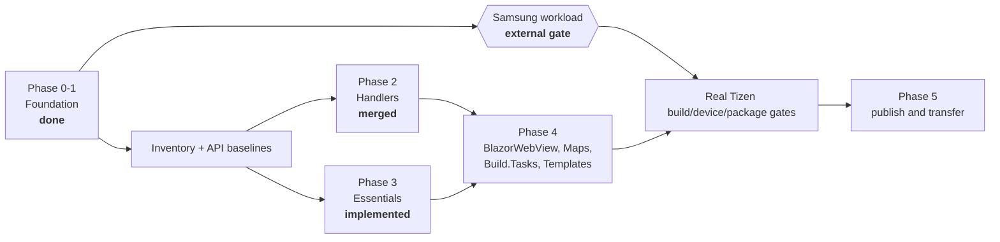

# Migration

Extracting the .NET MAUI Tizen backend from `dotnet/maui` into this repository.

## Status

| Phase | Scope | Status |
|---|---|---|
| **0** | Freeze baselines; inventory and disposition manifests; API baselines | **Complete** |
| **1** | History-preserving import; repository scaffolding; docs; CI | **Complete** |
| **2** | Handler implementation (`Maui.Tizen.Core`, `Maui.Tizen.Controls`) | **Core and Waves A/B/C merged** |
| **3** | Essentials implementation | **Implemented and host/API15 tested; two external MAUI API blockers remain** |
| 4 | BlazorWebView, Maps, Build.Tasks, Templates | Maps disposition complete (no API15 implementation); remaining packages in progress |
| 5 | Device tests, samples, packaging and publishing | Not started |

The Samsung workload blocks real Tizen-TFM builds, packaging and device execution. It does not
block implementation: host-executable coordinators, API15 ref-pack builds, source/convention
guards, mutation tests and the merged handler stack all run without it.

## The external gate

> **`net11.0-tizen11.0` cannot be restored or built by anyone today.**

The workload manifest `Samsung.NET.Sdk.Tizen.Manifest-11.0.100-preview.7` has not been published to
nuget.org. Only the `9.0.100` and `10.0.100` bands exist, and the newest
`Samsung.Tizen.Sdk` is `10.0.128`.

This is an external dependency on Samsung, not something this repository can engineer
around. It is handled as follows:

- **Never faked.** There is no neutral `net11.0` fallback. A neutral build would be green
  and useless — assemblies that compile but cannot run on Tizen.
- **Never silently skipped.** The `tizen-workload-gate` CI job runs on every build and
  reports its status in the job summary. When both expected manifest IDs return 404 it is
  an informational success. When either exists, the same unconditional step installs the
  workload and runs the real Tizen lane; there is no `continue-on-error` or skipped
  follow-up step that can hide a failure.
- **Explicit at build time.** Building a Tizen project without the workload fails with
  `MAUITIZEN0001`, which explains the situation rather than surfacing a raw
  `NETSDK1139` about an unknown target platform.

### What is validated in the meantime

The lane in `eng/build-workload-free.sh` (required in CI) genuinely exercises:

- the SDK pin and `global.json` band
- central package management and package source mapping
- MSBuild conventions and the workload gate itself
- consistency between `Directory.Build.props`, `global.json` and `eng/baselines.json`
- the complete Core/Waves host suites and Core/Controls/Sample/Essentials API15 ref-pack lanes
- the implemented Essentials DI, storage, permission, AppControl, dispatcher and lifecycle tests
- package/source/PublicAPI/analyzer closure checks and locked Essentials/Wave B/Wave C mutations
- migration tooling, package graph, consumer compile and repository invariant suites
- integrity of the imported history and the import tooling

At this integration head the principal executable inventories are 1,248 Core/Waves tests, 449
Essentials tests in both Debug and Release, and 579 source/closure/parity tests. The canonical
script also executes the repository, tooling, negative-control and hosted suites rather than
inferring their result from a successful build.

Hosted validation also runs validation, build, convention, DevFlow and consumer suites. Device
behaviour, shipping packages and visual baselines remain explicitly gated rather than inferred.

### When the gate lifts

The transition is automatic and fail-closed:

1. `eng/ci/tizen-workload-gate.sh` probes the preview and stable feature-band manifest IDs,
   both derived from `eng/baselines.json`.
2. A 404 for both remains an informational external-gate success. Network errors,
   malformed responses, and unexpected status codes fail because availability is unknown.
3. When either package exists, CI runs Samsung's commit-pinned supported installer with the
   exact published manifest version, then verifies the installed manifest through the
   repository's `_DetectTizenWorkload` target.
4. `eng/build-tizen.sh` restores, builds, and invokes Pack for every actual
   `net11.0-tizen11.0` product project. Any install, restore, build, or pack failure fails
   the workflow.
5. After that lane is green, regenerate API baselines against the real Tizen build and run the
   device/profile/visual/package gates.

### SecureStorage data migration

The standalone Essentials package stores secure values under
`maui.tizen.securestorage:~v2~<base64url-utf8-key>`. The escaped-version delimiter cannot collide
with the first standalone package's alias encoder. Strict UTF-8 makes the encoding injective and
rejects unpaired UTF-16 surrogates before any store mutation. The result contains no whitespace or
padding rejected by Tizen's secure repository. Aliases are never truncated or hashed to fit a
native limit; Tizen's argument error is surfaced instead.

`GetAsync` performs a one-way, per-key compatibility migration in this order: v2 alias, the first
standalone package's escaped namespaced alias, then the in-box backend's exact raw alias. A legacy
value is copied to v2. Invalid-format legacy probes, including whitespace raw aliases Tizen cannot
read, are treated as absent rather than as storage failures. Raw aliases are never deleted because
the application-wide secure repository cannot prove that alias is owned by SecureStorage. A
migration save failure is surfaced and leaves the legacy value intact.

`SetAsync` stages the new bytes under a versioned transaction alias before removing either owned
generation. A failed commit restores the prior v1/v2 aliases; if restoration itself fails, the
staged bytes remain recoverable by the next read. Successful replacement removes duplicate v1 and
transaction aliases. `Remove` deletes both owned generations, and `RemoveAll` deletes unqualified
owned aliases plus qualified aliases whose owner exactly matches the current package id; a foreign
package using the same raw prefix is preserved. Both removal paths write tombstones in the
application preference store.
Those tombstones suppress legacy fallback, so an unowned raw alias cannot
resurrect a removed SecureStorage value. There is no safe way to distinguish an old SecureStorage
raw alias from certificates, keys, or another component's data in the shared repository. Tombstones
are persistent and may accumulate: removing one while its shadowed raw alias still exists would
make deleted data readable again.

### Preferences data migration

Preferences now use a versioned `maui.tizen.preferences:v2:` physical namespace with distinct
default-store and named-store prefixes. This fixes two collisions in the old flat layout: a default
key such as `a~b` could alias named store `a`, key `b`, and clearing the default store called Tizen's
application-wide `RemoveAll`, deleting every named store too.

Reads prefer the v2 key and fall back to the exact legacy alias used by the in-box backend and the
first standalone package revision. A successful legacy read copies the value into v2. The old alias
is intentionally retained because the legacy layout is ambiguous: deleting `a~b` cannot prove
whether it belonged to the default store or a named store. Per-key `Remove`/null `Set` and
per-store `Clear` write v2 tombstones instead of deleting ambiguous aliases, so later reads cannot
resurrect removed data or cross-delete another logical store. `Clear` removes only the selected
store's unambiguous v2 entries and never performs a native global clear.

Tizen's native preference store supports only its documented primitive types. `long` and
`DateTime` therefore use invariant versioned strings, `DateTimeOffset` uses a tagged round-trip
string, and `float` is stored as `double` with a checked exact conversion on read. Compatibility
reads migrate the earlier unsupported direct representations when encountered in development or
legacy stores.

### Target contract provenance

The `tizen11.0` / API15 contract is **verified from Samsung workload PR #310**, not
inferred:

| Item | Value |
|---|---|
| Target framework | `net11.0-tizen11.0` |
| Reference pack | `Samsung.Tizen.Ref.API15` 15.0.0.19396 (TizenFX API15) |
| `tizen-manifest.xml` | api-version 11 |
| SDK band | 11.0.100-preview.7 |

No API16 or new reference pack is required — API15 is sufficient.

### Dependency advisories

The repository audits NuGet dependencies at level `low` with warnings-as-errors, because
this code ships to Tizen devices where patching is slow. The cost is that a newly
published advisory against an existing dependency would otherwise turn an unrelated PR red
with no warning.

The scheduled [`dependency-audit`](../.github/workflows/dependency-audit.yml) workflow
moves that discovery out of band: it runs weekly and files an issue rather than ambushing
whoever opens the next PR. Resolution order is bump the package, bump the transitive
dependency explicitly, then — only if no patched version exists — add a
`NuGetAuditSuppress` entry with a written justification and a re-review date. Lowering
`NuGetAuditLevel` is not an option; it converts one known problem into an unknown number.

## Baselines

All pinned in [`eng/baselines.json`](../eng/baselines.json). Pinned to **commit SHAs,
never branch names** — `origin/net11.0` advanced from `ee4d06cde6` to `bedd1b18b7` during
the few hours the initial import was prepared.

| Role | Value |
|---|---|
| `sourceBaseline` | `ee4d06cde6` — dotnet/maui `net11.0` @ 2026-08-18 |
| `requiredAncestor` | `0b3bb76d2d` — PR #36657, Essentials/MainThread extensibility |
| `behaviorBaseline` | `c1f4f7d879` — tag `9.0.120`, last published Tizen release |
| `developmentPackageBaseline` | `11.0.0-preview.7.26426.4` from the dnceng `dotnet11` feed |

Two traps worth repeating:

1. **`0b3bb76d2d` is not on `main`.** It lives on `net11.0`. Baselining against `main`
   omits the extensibility work the whole architecture depends on.
2. **`src/Compatibility` is not on `net11.0`.** It was deleted upstream; its 70 Tizen
   files exist only at `9.0.120`. Any inventory that reads only the `net11.0` tree
   under-reports by 70 files without any error.

## Disposition legend

Every Tizen-relevant file in both baselines carries exactly one disposition, recorded in
the manifest under [`eng/manifests/`](../eng/manifests/) against
[`source-disposition.schema.json`](../eng/manifests/source-disposition.schema.json).

| Disposition | Meaning |
|---|---|
| `move` | Carried over as-is |
| `rename` | Carried over at a different path or name |
| `rebuild` | Reimplemented here — typically extracting an `#if TIZEN` branch, or reworking a partial type that cannot span an assembly boundary |
| `keep-upstream` | Stays in `dotnet/maui`; consumed from the published neutral assembly |
| `exclude` | Deliberately dropped — **requires a written justification**, so "excluded" is never indistinguishable from "overlooked" |

Files whose `kind` is `shared-conditional` (a shared file with `#if TIZEN` branches) may
**never** be `move`. Copying one forks the non-Tizen code alongside it. The schema
enforces this.

### Scale

| Category | Count | Baseline |
|---|---|---|
| Tizen-named files | 314 | `net11.0` (`ee4d06cde6`) |
| Shared files with `#if TIZEN` | 135 | `net11.0` |
| `PublicAPI/net-tizen` baselines | 18 | `net11.0` |
| Tizen-named files present at `9.0.120` but **absent** at the net11.0 pin | 87 | `9.0.120` only |

The 87 files that exist only at `9.0.120` break down as:

| Path | Count | Note |
|---|---|---|
| `src/Compatibility/**` | 70 | Core 48, Material 17, Maps 5 — the old top-level Xamarin.Forms compatibility stack |
| `src/Controls/docs/…TizenSpecific/*.xml` | 9 | API documentation XML |
| `src/Templates/**/Platforms/Tizen/**` | 7 | Template platform assets |
| `src/Essentials/**` | 1 | `AppleSignInAuthenticator.netstandard.android.tvos.watchos.uwp.tizen.macos.cs` |

> **Do not confuse the two "Compatibility" locations.**
> `src/Controls/src/Core/Compatibility/**` — the legacy renderer shim (`FrameRenderer`,
> `ViewRenderer`, ListView/TableView adapters) — is **still present on `net11.0`** with an
> identical 11-file Tizen set at both refs, and was imported normally. Only the top-level
> `src/Compatibility/**` was removed.

> **Counting note.** These are **blob** counts. The GitHub tree API returns `tree`
> (directory) entries alongside blobs, so filtering on "path contains tizen" without also
> filtering `type == blob` inflates every figure — it yields 76 for `src/Compatibility`
> and 102 overall by counting `Tizen/` directories as if they were files. The manifest is
> per-file, so blobs are the correct unit.

## Known open decisions

| Decision | Current position |
|---|---|
| **Compatibility layer** | .NET MAUI 11 drops it. Audit each of the 70 files; `move` only what net11 Tizen handlers genuinely require, `exclude` the rest. Expected outcome: the package is deleted entirely. |
| **Graphics** | `Microsoft.Maui.Graphics` is upstreamed from its own repository and carries one Tizen view here. Likely `keep-upstream` — contribute the view back rather than shipping a package. |
| **Build.Tasks** | The imported Tizen tasks depend on shared Resizetizer types (`ILogger`, `ResizeImageInfo`, `ResizedImageInfo`) whose filenames contain no "tizen" and were therefore correctly excluded by the import filter. Either vendor them here, or ship these tasks inside `Microsoft.Maui.Resizetizer` upstream. **Also unresolved:** these tasks use SkiaSharp for splash/icon generation, so enabling them raises real runtime and native-asset packaging questions (which SkiaSharp native assets ship, and how they reach a Tizen build). That is deliberately *not* papered over in the foundation — it is part of enabling the project, not of scaffolding it. |
| **Documentation warnings** | Shipping Core, Controls and Essentials explicitly opt into XML documentation before importing `TizenPackage.props`; projects that still compile nothing retain the no-documentation default. `CS1591` remains suppressed until package-by-package documentation completion. |
| **`Tizen.UIExtensions`** | Needs republishing to drop its .NET 6-era `Microsoft.Maui.Graphics` dependencies. No API surface change expected. |

## The import

Two deliberately separate commits, both reproducible from `eng/import/`:

1. **Raw import** — mechanical filter of `dotnet/maui` to Tizen paths. No file content
   modified.
2. **Normalization** — pure `git mv` into this repository's layout. 316 renames, zero
   content changes.

Kept apart so a reviewer can verify that nothing was smuggled in during the filter by
diffing the import commit alone. Full detail in [`../PROVENANCE.md`](../PROVENANCE.md).

## Stacked workstreams

Implementation and hosted verification proceed now. Only Tizen workload, device and publishing
evidence remain downstream of the Samsung gate.

## See also

- [`architecture.md`](architecture.md) — collision rules, namespace and package policy
- [`../PROVENANCE.md`](../PROVENANCE.md) — what was imported and how
- [`../eng/baselines.json`](../eng/baselines.json) — the pinned baselines
