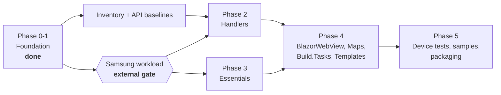

# Migration

Extracting the .NET MAUI Tizen backend from `dotnet/maui` into this repository.

## Status

| Phase | Scope | Status |
|---|---|---|
| **0** | Freeze baselines; inventory and disposition manifests; API baselines | Contract landed; generated data in progress |
| **1** | History-preserving import; repository scaffolding; docs; CI | **Complete** |
| 2 | Handler implementation (`Maui.Tizen.Core`, `Maui.Tizen.Controls`) | Not started |
| 3 | Essentials implementation | Not started |
| 4 | BlazorWebView, Maps, Build.Tasks, Templates | Not started |
| 5 | Device tests, samples, packaging and publishing | Not started |

Phases 2 onward are **blocked on an external dependency** — see below.

## The external gate

> **`net11.0-tizen11.0` cannot be restored or built by anyone today.**

The workload manifest `samsung.net.sdk.tizen.manifest-11.0.100` has not been published to
nuget.org. Only the `9.0.100` and `10.0.100` bands exist, and the newest
`Samsung.Tizen.Sdk` is `10.0.128`.

This is an external dependency on Samsung, not something this repository can engineer
around. It is handled as follows:

- **Never faked.** There is no neutral `net11.0` fallback. A neutral build would be green
  and useless — assemblies that compile but cannot run on Tizen.
- **Never silently skipped.** The `tizen-workload-gate` CI job runs on every build and
  reports its status in the job summary. It does not disappear from the checks list.
- **Explicit at build time.** Building a Tizen project without the workload fails with
  `MAUITIZEN0001`, which explains the situation rather than surfacing a raw
  `NETSDK1139` about an unknown target platform.

### What is validated in the meantime

The lane in `eng/build-workload-free.sh` (required in CI) genuinely exercises:

- the SDK pin and `global.json` band
- central package management and package source mapping
- MSBuild conventions and the workload gate itself
- consistency between `Directory.Build.props`, `global.json` and `eng/baselines.json`
- 20 repository invariant tests, built and executed on `net11.0`
- integrity of the imported history and the import tooling

So when the workload does ship, the workload is the *only* thing that needs to start
working.

### When the gate lifts

1. The `tizen-workload-gate` job starts succeeding and builds `Maui.Tizen.slnx`.
2. Promote that job to a required check.
3. Regenerate API baselines against a real Tizen build.
4. Begin Phase 2.

## Baselines

All pinned in [`eng/baselines.json`](../eng/baselines.json). Pinned to **commit SHAs,
never branch names** — `origin/net11.0` advanced from `ee4d06cde6` to `bedd1b18b7` during
the few hours the initial import was prepared.

| Role | Value |
|---|---|
| `sourceBaseline` | `ee4d06cde6` — dotnet/maui `net11.0` @ 2026-08-18 |
| `requiredAncestor` | `0b3bb76d2d` — PR #36657, Essentials/MainThread extensibility |
| `behaviorBaseline` | `c1f4f7d879` — tag `9.0.120`, last published Tizen release |
| `developmentPackageBaseline` | `11.0.0-preview.7.26418.3` from the dnceng `dotnet11` feed |

Two traps worth repeating:

1. **`0b3bb76d2d` is not on `main`.** It lives on `net11.0`. Baselining against `main`
   omits the extensibility work the whole architecture depends on.
2. **`src/Compatibility` is not on `net11.0`.** It was deleted upstream; its 70 Tizen
   files exist only at `9.0.120`. Any inventory that reads only the `net11.0` tree
   under-reports by 70 files without any error.

## Disposition legend

Every Tizen-relevant file in both baselines carries exactly one disposition, recorded in
the manifest under [`eng/manifests/`](../eng/manifests/) against
[`source-disposition.schema.json`](../eng/manifests/source-disposition.schema.json).

| Disposition | Meaning |
|---|---|
| `move` | Carried over as-is |
| `rename` | Carried over at a different path or name |
| `rebuild` | Reimplemented here — typically extracting an `#if TIZEN` branch, or reworking a partial type that cannot span an assembly boundary |
| `keep-upstream` | Stays in `dotnet/maui`; consumed from the published neutral assembly |
| `exclude` | Deliberately dropped — **requires a written justification**, so "excluded" is never indistinguishable from "overlooked" |

Files whose `kind` is `shared-conditional` (a shared file with `#if TIZEN` branches) may
**never** be `move`. Copying one forks the non-Tizen code alongside it. The schema
enforces this.

### Scale

| Category | Count | Baseline |
|---|---|---|
| Tizen-named files | 338 | `net11.0` |
| Shared files with `#if TIZEN` | 136 | `net11.0` |
| `PublicAPI/net-tizen` baselines | 18 | `net11.0` |
| Compatibility Tizen files | 70 | `9.0.120` only |

## Known open decisions

| Decision | Current position |
|---|---|
| **Compatibility layer** | .NET MAUI 11 drops it. Audit each of the 70 files; `move` only what net11 Tizen handlers genuinely require, `exclude` the rest. Expected outcome: the package is deleted entirely. |
| **Graphics** | `Microsoft.Maui.Graphics` is upstreamed from its own repository and carries one Tizen view here. Likely `keep-upstream` — contribute the view back rather than shipping a package. |
| **Build.Tasks** | The imported Tizen tasks depend on shared Resizetizer types (`ILogger`, `ResizeImageInfo`, `ResizedImageInfo`) whose filenames contain no "tizen" and were therefore correctly excluded by the import filter. Either vendor them here, or ship these tasks inside `Microsoft.Maui.Resizetizer` upstream. |
| **`Tizen.UIExtensions`** | Needs republishing to drop its .NET 6-era `Microsoft.Maui.Graphics` dependencies. No API surface change expected. |

## The import

Two deliberately separate commits, both reproducible from `eng/import/`:

1. **Raw import** — mechanical filter of `dotnet/maui` to Tizen paths. No file content
   modified.
2. **Normalization** — pure `git mv` into this repository's layout. 316 renames, zero
   content changes.

Kept apart so a reviewer can verify that nothing was smuggled in during the filter by
diffing the import commit alone. Full detail in [`../PROVENANCE.md`](../PROVENANCE.md).

## Stacked workstreams

Inventory work can proceed now. Everything downstream of the gate cannot.

## See also

- [`architecture.md`](architecture.md) — collision rules, namespace and package policy
- [`../PROVENANCE.md`](../PROVENANCE.md) — what was imported and how
- [`../eng/baselines.json`](../eng/baselines.json) — the pinned baselines
