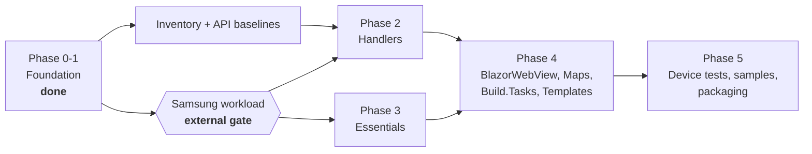

# Migration

Extracting the .NET MAUI Tizen backend from `dotnet/maui` into this repository.

## Status

| Phase | Scope | Status |
|---|---|---|
| **0** | Freeze baselines; inventory and disposition manifests; API baselines | Contract landed; generated data in progress |
| **1** | History-preserving import; repository scaffolding; docs; CI | **Complete** |
| 2 | Handler implementation (`Maui.Tizen.Core`, `Maui.Tizen.Controls`) | Not started |
| 3 | Essentials implementation | Not started |
| 4 | BlazorWebView, Maps, Build.Tasks, Templates | Not started |
| 5 | Device tests, samples, packaging and publishing | Not started |

Phases 2 onward are **blocked on an external dependency** — see below.

## The external gate

> **`net11.0-tizen11.0` cannot be restored or built by anyone today.**

The workload manifest `Samsung.NET.Sdk.Tizen.Manifest-11.0.100-preview.7` has not been published to
nuget.org. Only the `9.0.100` and `10.0.100` bands exist, and the newest
`Samsung.Tizen.Sdk` is `10.0.128`.

This is an external dependency on Samsung, not something this repository can engineer
around. It is handled as follows:

- **Never faked.** There is no neutral `net11.0` fallback. A neutral build would be green
  and useless — assemblies that compile but cannot run on Tizen.
- **Never silently skipped.** The `tizen-workload-gate` CI job runs on every build and
  reports its status in the job summary. When both expected manifest IDs return 404 it is
  an informational success. When either exists, the same unconditional step installs the
  workload and runs the real Tizen lane; there is no `continue-on-error` or skipped
  follow-up step that can hide a failure.
- **Explicit at build time.** Building a Tizen project without the workload fails with
  `MAUITIZEN0001`, which explains the situation rather than surfacing a raw
  `NETSDK1139` about an unknown target platform.

### What is validated in the meantime

The lane in `eng/build-workload-free.sh` (required in CI) genuinely exercises:

- the SDK pin and `global.json` band
- central package management and package source mapping
- MSBuild conventions and the workload gate itself
- consistency between `Directory.Build.props`, `global.json` and `eng/baselines.json`
- 20 repository invariant tests, built and executed on `net11.0`
- integrity of the imported history and the import tooling

So when the workload does ship, the workload is the *only* thing that needs to start
working.

### When the gate lifts

The transition is automatic and fail-closed:

1. `eng/ci/tizen-workload-gate.sh` probes the preview and stable feature-band manifest IDs,
   both derived from `eng/baselines.json`.
2. A 404 for both remains an informational external-gate success. Network errors,
   malformed responses, and unexpected status codes fail because availability is unknown.
3. When either package exists, CI runs Samsung's commit-pinned supported installer with the
   exact published manifest version, then verifies the installed manifest through the
   repository's `_DetectTizenWorkload` target.
4. `eng/build-tizen.sh` restores, builds, and invokes Pack for every actual
   `net11.0-tizen11.0` product project. Any install, restore, build, or pack failure fails
   the workflow.
5. After that lane is green, regenerate API baselines against the real Tizen build and
   begin Phase 2.

### Target contract provenance

The `tizen11.0` / API15 contract is **verified from Samsung workload PR #310**, not
inferred:

| Item | Value |
|---|---|
| Target framework | `net11.0-tizen11.0` |
| Reference pack | `Samsung.Tizen.Ref.API15` 15.0.0.19396 (TizenFX API15) |
| `tizen-manifest.xml` | api-version 11 |
| SDK band | 11.0.100-preview.7 |

No API16 or new reference pack is required — API15 is sufficient.

### Dependency advisories

The repository audits NuGet dependencies at level `low` with warnings-as-errors, because
this code ships to Tizen devices where patching is slow. The cost is that a newly
published advisory against an existing dependency would otherwise turn an unrelated PR red
with no warning.

The scheduled [`dependency-audit`](../.github/workflows/dependency-audit.yml) workflow
moves that discovery out of band: it runs weekly and files an issue rather than ambushing
whoever opens the next PR. Resolution order is bump the package, bump the transitive
dependency explicitly, then — only if no patched version exists — add a
`NuGetAuditSuppress` entry with a written justification and a re-review date. Lowering
`NuGetAuditLevel` is not an option; it converts one known problem into an unknown number.

## Baselines

All pinned in [`eng/baselines.json`](../eng/baselines.json). Pinned to **commit SHAs,
never branch names** — `origin/net11.0` advanced from `ee4d06cde6` to `bedd1b18b7` during
the few hours the initial import was prepared.

| Role | Value |
|---|---|
| `sourceBaseline` | `ee4d06cde6` — dotnet/maui `net11.0` @ 2026-08-18 |
| `requiredAncestor` | `0b3bb76d2d` — PR #36657, Essentials/MainThread extensibility |
| `behaviorBaseline` | `c1f4f7d879` — tag `9.0.120`, last published Tizen release |
| `developmentPackageBaseline` | `11.0.0-preview.7.26426.4` from the dnceng `dotnet11` feed |

Two traps worth repeating:

1. **`0b3bb76d2d` is not on `main`.** It lives on `net11.0`. Baselining against `main`
   omits the extensibility work the whole architecture depends on.
2. **`src/Compatibility` is not on `net11.0`.** It was deleted upstream; its 70 Tizen
   files exist only at `9.0.120`. Any inventory that reads only the `net11.0` tree
   under-reports by 70 files without any error.

## Disposition legend

Every Tizen-relevant file in both baselines carries exactly one disposition, recorded in
the manifest under [`eng/manifests/`](../eng/manifests/) against
[`source-disposition.schema.json`](../eng/manifests/source-disposition.schema.json).

| Disposition | Meaning |
|---|---|
| `move` | Carried over as-is |
| `rename` | Carried over at a different path or name |
| `rebuild` | Reimplemented here — typically extracting an `#if TIZEN` branch, or reworking a partial type that cannot span an assembly boundary |
| `keep-upstream` | Stays in `dotnet/maui`; consumed from the published neutral assembly |
| `exclude` | Deliberately dropped — **requires a written justification**, so "excluded" is never indistinguishable from "overlooked" |

Files whose `kind` is `shared-conditional` (a shared file with `#if TIZEN` branches) may
**never** be `move`. Copying one forks the non-Tizen code alongside it. The schema
enforces this.

### Scale

| Category | Count | Baseline |
|---|---|---|
| Tizen-named files | 314 | `net11.0` (`ee4d06cde6`) |
| Shared files with `#if TIZEN` | 135 | `net11.0` |
| `PublicAPI/net-tizen` baselines | 18 | `net11.0` |
| Tizen-named files present at `9.0.120` but **absent** at the net11.0 pin | 87 | `9.0.120` only |

The 87 files that exist only at `9.0.120` break down as:

| Path | Count | Note |
|---|---|---|
| `src/Compatibility/**` | 70 | Core 48, Material 17, Maps 5 — the old top-level Xamarin.Forms compatibility stack |
| `src/Controls/docs/…TizenSpecific/*.xml` | 9 | API documentation XML |
| `src/Templates/**/Platforms/Tizen/**` | 7 | Template platform assets |
| `src/Essentials/**` | 1 | `AppleSignInAuthenticator.netstandard.android.tvos.watchos.uwp.tizen.macos.cs` |

> **Do not confuse the two "Compatibility" locations.**
> `src/Controls/src/Core/Compatibility/**` — the legacy renderer shim (`FrameRenderer`,
> `ViewRenderer`, ListView/TableView adapters) — is **still present on `net11.0`** with an
> identical 11-file Tizen set at both refs, and was imported normally. Only the top-level
> `src/Compatibility/**` was removed.

> **Counting note.** These are **blob** counts. The GitHub tree API returns `tree`
> (directory) entries alongside blobs, so filtering on "path contains tizen" without also
> filtering `type == blob` inflates every figure — it yields 76 for `src/Compatibility`
> and 102 overall by counting `Tizen/` directories as if they were files. The manifest is
> per-file, so blobs are the correct unit.

## Known open decisions

| Decision | Current position |
|---|---|
| **Compatibility layer** | .NET MAUI 11 drops it. Audit each of the 70 files; `move` only what net11 Tizen handlers genuinely require, `exclude` the rest. Expected outcome: the package is deleted entirely. |
| **Graphics** | `Microsoft.Maui.Graphics` is upstreamed from its own repository and carries one Tizen view here. Likely `keep-upstream` — contribute the view back rather than shipping a package. |
| **Build.Tasks** | The imported Tizen tasks depend on shared Resizetizer types (`ILogger`, `ResizeImageInfo`, `ResizedImageInfo`) whose filenames contain no "tizen" and were therefore correctly excluded by the import filter. Either vendor them here, or ship these tasks inside `Microsoft.Maui.Resizetizer` upstream. **Also unresolved:** these tasks use SkiaSharp for splash/icon generation, so enabling them raises real runtime and native-asset packaging questions (which SkiaSharp native assets ship, and how they reach a Tizen build). That is deliberately *not* papered over in the foundation — it is part of enabling the project, not of scaffolding it. |
| **Documentation warnings** | `CS1591` is suppressed in `TizenPackage.props` while projects compile nothing. The inherited sources are not uniformly documented, so flipping a project to compile would otherwise fail on hundreds of missing-comment errors under warnings-as-errors. Remove the suppression per project as its documentation is completed. |
| **`Tizen.UIExtensions`** | Needs republishing to drop its .NET 6-era `Microsoft.Maui.Graphics` dependencies. No API surface change expected. |

## The import

Two deliberately separate commits, both reproducible from `eng/import/`:

1. **Raw import** — mechanical filter of `dotnet/maui` to Tizen paths. No file content
   modified.
2. **Normalization** — pure `git mv` into this repository's layout. 316 renames, zero
   content changes.

Kept apart so a reviewer can verify that nothing was smuggled in during the filter by
diffing the import commit alone. Full detail in [`../PROVENANCE.md`](../PROVENANCE.md).

## Stacked workstreams

Inventory work can proceed now. Everything downstream of the gate cannot.

## See also

- [`architecture.md`](architecture.md) — collision rules, namespace and package policy
- [`../PROVENANCE.md`](../PROVENANCE.md) — what was imported and how
- [`../eng/baselines.json`](../eng/baselines.json) — the pinned baselines
